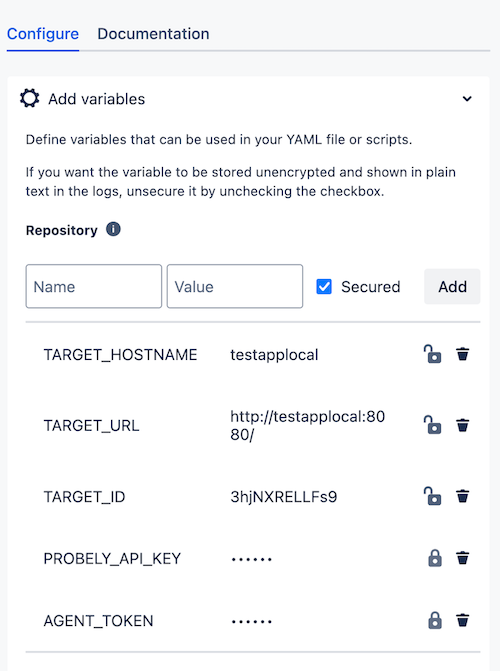
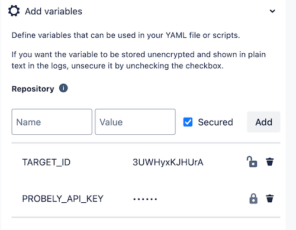

# cicd-pipeline-scan-examples

CI/CD pipeline scan examples (GitHub actions, BitBucket, and more)

## Integrations

### Common actions

- All examples use Probely's CLI
  - https://developers.probely.com/cli/overview-cli-documentation/

#### Running a scan on an ephemeral application

- Create the target on Probely with the desired internal hostname (ex: `http://testapplocal:8080/`)
  - https://help.probely.com/en/articles/5733114-how-to-add-a-target
- Create an API Key on Probely with the right permissions to start a scan on this target
  - https://help.probely.com/en/articles/8592281-how-to-generate-an-api-key
- Create a Scanning Agent on Probely and add it to the target
  - (Step 1) https://help.probely.com/en/articles/6503388-how-to-install-a-scanning-agent

#### Running a scan on a remote target (target running on your server) in blocking and non-blocking mode

- Create the target on Probely 
  - https://help.probely.com/en/articles/5733114-how-to-add-a-target
- Create an API Key on Probely with the right permissions to start a scan on this target
  - https://help.probely.com/en/articles/8592281-how-to-generate-an-api-key

**NOTE:** You can use the app provided in this repo to test the integration.

### GitHub Actions

Create a GitHub action using the following YAML examples:

- Running a scan on an ephemeral application in blocking mode
  - YAML file
  - Configuration

- Running a scan on a remote target in blocking mode
  - YAML file
  - Configuration

- Running a scan on a remote target in non-blocking mode
  - YAML file
  - Configuration

### BitBucket

Create a `bitbucket-pipelines.yml` file using the following YAML examples:

- Running a scan on an ephemeral application in **blocking mode** (requires the `scanning-agent/farcasterd-linux-amd64-0.4.3` file)
  - [YAML file](./cicd-examples/bitbucket/bitbucket-ephemeral-app-blocking-mode.yaml)
  - Configuration:
    - 

- Running a scan on a remote target in blocking mode
  - [YAML file](./cicd-examples/bitbucket/bitbucket-remote-app-blocking-mode.yaml)
  - Configuration
    - 

- Running a scan on a remote target in non-blocking mode
  - [YAML file](./cicd-examples/bitbucket/bitbucket-remote-app-non-blocking-mode.yaml)
  - Configuration
    - 